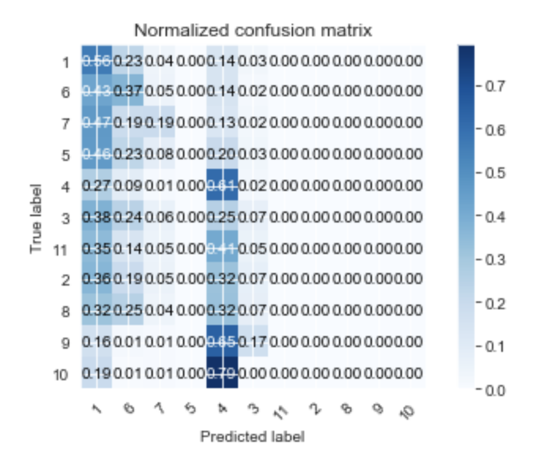
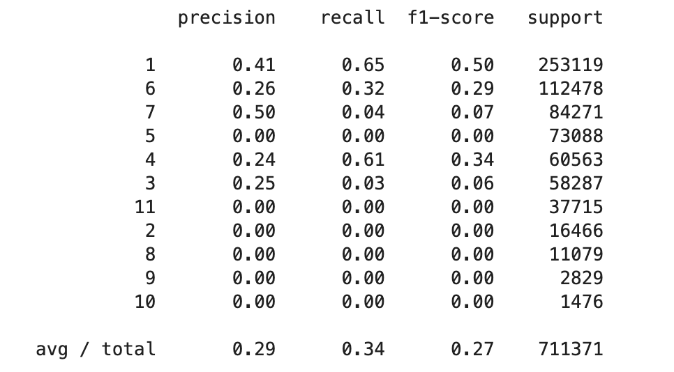

# Description

Built an MLB pitch predictor using Machine Learning to help coaches and players better strategize during games
•	Used a Kaggle data set consisting of over 2 million pitches from 2015 to 2018 
•	Utilized Scikit-Learn to build a random forest which classified 11 different MLB pitches with a 35% success rate
•	Feature engineered previous pitch and interaction variables

# Demonstration of results

confusion matrix visualization

model performance

# Future improvements

+ test interaction terms
+ implement a deep learning algorithm to test more potential models
+ create a cross-validation script for assessing the accuracy of the model
 
 
