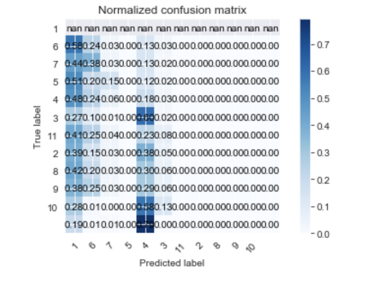

# Description

Baseball is fun! Wouldn't it be more fun to predict baseball pitches!???

# Demonstration of results

Here is the confusion matrix visualization that I did:

Here is the how well the model performance at predicting base pitch for an unknown dataset.

# Future improvements

+ test interaction terms
+ implement a deep learning algorithm to test more potential models
+ create a cross-validation script for assessing the accuracy of the model
